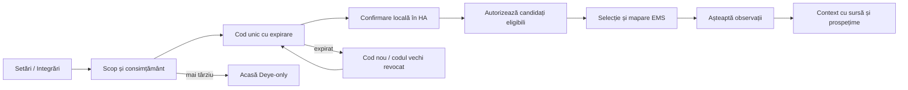

# Parcursuri mobile și wireflow

[Înapoi la specificație](README.md) · [Stări](STATES.md) ·
[Prototip](wireframes.html)

ID-urile S01–S17 sunt comune selectorului de ecrane și matricei de stări.
Pașii din acest document sunt comportamentul țintă; prototipul demonstrează
tranzițiile, fără autentificare sau operații externe reale.

## J01 — Prima pornire (S01 → S02 → S03/S06)

1. S01 explică monitorizarea și cele două surse: Deye de bază, HA opțional.
   „Creează cont” și „Am deja cont”. Nu cere push, locație, acces LAN sau HA.
2. S02 permite signup/login/recuperare acces. Acceptarea termenilor și
   politicii versionate se separă de analytics opțional, implicit oprit.
3. După login, serverul enumeră numai stațiile autorizate. Una → S06 direct;
   mai multe → alegere; zero → S03 dacă utilizatorul poate conecta.
4. Pentru signup nou, #200/#201 trebuie să creeze idempotent organizația
   personală și stația asociată importului, cu drepturi explicite. Un membru
   invitat nu creează automat alt tenant și vede invitația/accesul existent.
5. Se poate ieși din wizard; reluarea recitește progresul serverului. Lipsa
   datelor după conectare înseamnă „Așteptăm prima sincronizare”, nu succes
   cu zerouri. HA poate fi adăugat ulterior din Setări.

Ieșire de succes: S06 cu cel puțin o observație reală și sursa ei.
Deye în așteptare nu blochează accesul la profil/privacy.

## J02 — Autentificare și recuperare (S02)

- Login folosește identitatea EMS existentă; UI oferă password manager și
  nu memorează parola. Sesiunea mobilă este distinctă de cookie-ul web (#200).
- Signup are email/parolă, acceptarea politicilor și răspuns neutru la
  adrese existente. Verificarea emailului/retrimiterea au stări explicite.
- Recuperarea confirmă neutru trimiterea; dacă serviciul email nu este
  disponibil, nu pretinde că a trimis. Invitațiile/linkurile expirate pot fi
  reluate; tokenurile sensibile nu apar în analytics sau URL-uri de tracking.
- La sesiune expirată, salvează doar destinația permisă, golește datele
  protejate și cere login. După login reverifică accesul, apoi revine.
- Logout local șterge sesiunea/cache-ul; revocarea server/push se confirmă
  online. Logout offline nu susține că a revocat alte dispozitive. S17
  permite revocarea altor sesiuni numai cu reautentificare și rețea.

## J03 — Conectare Deye (S03 → S06)

1. Administratorul vede scopul importului, regiunea și accesul read-only,
   confirmă consimțământul Deye; un viewer vede cine poate configura.
2. „Continuă în browser” deschide o sesiune de onboarding **EMS** în
   browserul sistemului. Forma actuală web cere app ID/secret și cont Deye;
   #201 trebuie să adapteze această pagină. Nu inventăm un grant OAuth Deye.
3. Secretele ajung doar la backendul EMS prin pagina securizată, nu la
   storage-ul aplicației. Dacă nu există credențiale de dezvoltator/region
   suportată, UI oferă instrucțiuni și reia ulterior, fără promisiunea unui
   login cu un singur click care nu există în conectorul curent.
4. Revenirea în app folosește o tranzacție scurtă, unică, validată și legată
   de sesiunea inițiatoare. Nu pune credențiale sau access/refresh tokenuri
   în deep link. Anularea browserului revine la S03 fără pierderea contului.
5. Se aleg doar stații Deye returnate de backend; dacă există deja legătura
   web, se reutilizează. O singură stație validă poate fi confirmată direct;
   selecția explicită evită importul tuturor instalațiilor.
6. Progres: „Conectat” → „Stație selectată” → „Așteptăm date”. După prima
   observație, S06. Retry este idempotent și nu creează stații duplicate.

Rate limit arată intervalul de retry al serverului, nu buclă imediată.
Token expirat → „Reconectează”; provider indisponibil → retry și istoric
existent marcat vechi. Deconectarea cere confirmarea efectului asupra
sincronizării; nu șterge implicit istoricul sau contul EMS.

## J04 — HA opțional și mapare (S12 → S04 → S05 → S06)

1. Administratorul citește categoriile și politica de retenție înainte de
   consimțământ. Occupancy are acord separat; refuzul nu afectează energia.
2. Backendul emite cod opac, unic, cu termen afișat. Utilizatorul îl introduce
   în bridge-ul/integratea HA locală; HA deschide conexiunea outbound.
   Preview-ul arată doar un placeholder pentru cod.
3. Numele instanței ajută confirmarea, dar nu este dovadă de autorizare.
   Codul expirat/folosit/respins cere restart sigur; revenirea din background
   recitește statusul. Regenerarea revocă tranzacția precedentă.
4. În HA se autorizează explicit candidații eligibili; S05 listează numai
   aceștia, cu domain, unitate, sursă, ultima observație și scop canonic.
5. Toate checkboxurile pornesc nebifate. EMS validează device/state class,
   unitatea și compatibilitatea; starea `unavailable` rămâne necunoscută.
   O entitate redenumită sau cu unitate schimbată poate cere remapare.
6. Revizuire selecție → salvează versiunea → așteaptă observații. Contextul
   de pe S06 nu înlocuiește telemetria Deye; o sursă veche este etichetată
   individual. Conectorul activ fără mapări are CTA „Alege entități”.
7. În Setări se pot elimina mapări/retrage consent/deconecta. Confirmarea
   backendului revocă bridge-ul și oprește colectarea; retenția datelor deja
   colectate este explicată. Cardul dispare după deconectare confirmată.

Fără HA: S06 nu afișează card sau eroare; Setări păstrează o invitație
discretă, „Opțional”. HA offline nu oprește sincronizarea Deye.

## J05 — Verificare rapidă (S06)

Utilizatorul deschide app și vede ultima imagine autorizată, marcată cache
până la refresh. Observă producția/consumul, direcția rețelei, SOC, sursa și
ora; poate răspunde „acum import sau export?”. Refresh actualizează datele
fără resetarea poziției de scroll sau requesturi paralele duplicate.

Tap pe o metrică → S07 cu aceeași stație/metrică. Tap pe prognoză → S09,
estimare → S10, incident → S16. Cardurile lipsă au explicație proprie.
Un avertisment de tensiune arată observație + prag operațional și nu declară
automat cauza sau o încălcare legală (regula web curentă: 253 V).

## J06 — Detaliu metrică și istoric (S07)

1. Se deschide metrica selectată, cu valoare, unitate, sursă și timp.
2. „Zi”, „Săptămână”, „Lună” + alegere dată, limite exacte în fusul stației.
   Zi este zi calendaristică; săptămâna începe luni; luna este calendaristică.
3. Backendul alege rezoluția și metoda. Putere kW, energie kWh și SOC % au
   axe/unități separate; nu se însumează kW sau SOC pentru un total zilnic.
4. Atingere punct și alternativă tabel pentru valori/timp/acoperire.
   Liniile se întrerup la goluri; „Acoperire 84%” nu devine total complet.
5. Compară cu perioada echivalentă când serverul o declară comparabilă.
   Navigarea între luni nu produce grafice goale interpretate ca zero.

Back revine la poziția de pe Acasă/Analiză. La schimbarea stației, se anulează
requestul precedent înainte ca răspunsul lui să poată actualiza noul grafic.

## J07 — Prognoză (S08 → S09)

„Azi/Mâine” arată totalul prognozat, realizatul până acum și intervalul de
incertitudine numai când există. Textul „Mâine se estimează…” identifică
estimarea; comparația procentuală apare numai cu un reper eligibil.
Detaliul explică meteo, umbrire, clipping, ediția, providerul și confidence.
Profil absent → „Necalibrat”; forecast expirat → „Prognoză veche”. O
schimbare de ediție actualizează întregul rezultat, nu amestecă două rulări.
Fără forecast sau fără comparație se păstrează mesajul explicit.

## J08 — Costul lunii (S08 → S10)

1. „Luna curentă” identifică data până la care există date. Primul card:
   cost acumulat estimat + proiecția restului lunii = estimare totală.
2. „Luna precedentă” arată separat totalul istoric estimat și coverage;
   comparația echivalentă până azi este o altă etichetă, dacă disponibilă.
3. Deschide defalcarea: import energie, taxe/TVA/abonament configurat,
   export/credit aplicat și eventual surplus separat. Sumele și eligibilitatea
   compensării vin exclusiv de la backend conform contractului.
4. „Metodă și ipoteze” arată versiunile tarifelor/forecastului, limitele
   perioadei, coverage, valori estimate și limitele soldurilor reportate.
5. Preț fix/dinamic și spot OPCOM sunt distincte. Prețurile negative rămân
   negative; conversia lei/MWh → lei/kWh se face pe server.
6. Fără tarif / tarif economic dezactivat / acoperire insuficientă:
   componente cunoscute vizibile, total „Indisponibil”; link setare web doar
   pentru cine poate configura. Nu se presupune că factura este zero.

Text persistent: „Estimare EMS, nu factură emisă.” Exemplele prototipului
ilustrează ierarhia, nu un calcul fiscal sau un contract implicit.

## J09 — Notificare și preferințe (S11 → S16 / S15)

Inboxul include sumarul pentru ieri în calendarul stației și incidentele,
filtre Toate/Sumare/Alerte și Necitite; ordinea și paginarea vin de la server.
S16 arată perioada raportată, sursa, calitatea, acoperirea și linkul relevant.
Marcarea citită confirmă serverul; offline nu scade definitiv contorul.
Un sumar corectat păstrează identitatea și starea de citire conform backendului.

S15 explică valoarea push înainte de promptul sistemului. „Mai târziu” și
refuzul păstrează inboxul complet. Categorii: sincronizare, incidente, prognoză,
cost/preț, sumar; alegere in-app/push, quiet hours și timezone explicite.
Occupancy în recomandări/push necesită acord separat, implicit oprit.

Push afișează text generic fără valori, adresă/nume stație sau occupancy pe
lock screen. Payload: referință opacă + tip de destinație permis, fără
tokenuri. Tap în foreground/background/cold start → login dacă e nevoie →
reverificare acces → S16/destinație. Notificare eliminată sau acces revocat
→ explicație și inbox disponibil, fără expunerea cache-ului vechi.

## J10 — Profil, privacy și ștergere (S12 → S13 → S14)

1. S12/S17: identitatea EMS, sesiuni active și logout. Schimbarea contului
   elimină datele vechi înainte de a încărca noua stație.
2. S13: inventar pe surse, scop/retenție, integrări, acorduri separate Deye,
   HA/categorii/occupancy, push și analytics. Retragerea se confirmă online.
   Exportul datelor personale este job autentificat, cu expirare și status;
   nu reutilizează doar CSV-ul energetic. Linkurile publice de politici și
   cerere de ștergere trebuie livrate de #207/#213.
3. S14 explică ce dispare, ce este partajat și ce trebuie păstrat cu motiv
   și termen. **Ștergerea persoanei nu șterge automat stația comună.** Dacă
   este ultimul administrator al organizației, serverul oferă transfer sau
   închidere explicită a organizației; nu lasă un tenant fără administrator.
4. Reautentificare → confirmare finală → cerere idempotentă → status server.
   Dacă cererea a fost primită, se revocă sesiunile și push-ul persoanei,
   se curăță datele locale. Se revocă accesul/credențialele integrărilor pe
   care lifecycle-ul le închide; credențialele partajate ale unei organizații
   păstrate se transferă/rotesc potrivit proprietății definite în #207.
5. „Cerere primită” diferă de „Ștergere finalizată”. Serverul raportează
   retențiile și starea; nu promitem ștergere instantanee sau cancel window
   înainte ca politica #207 să le definească. Timeout după submit recitește
   statusul, nu retrimite orb sau afirmă eșecul definitiv.

Offline nu poate confirma ștergerea. Back înainte de confirmarea finală
anulează intenția locală. Acceptarea ștergerii, revocarea și retenția cer
audit separat de analytics opțional.
