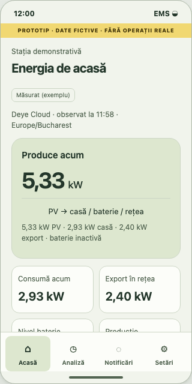
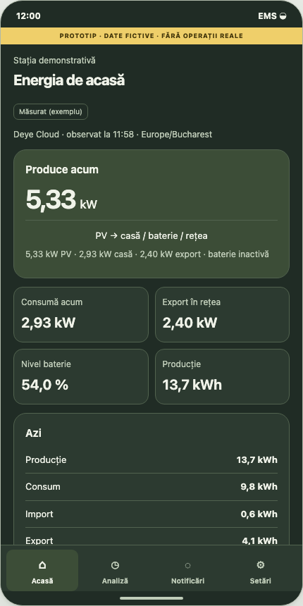
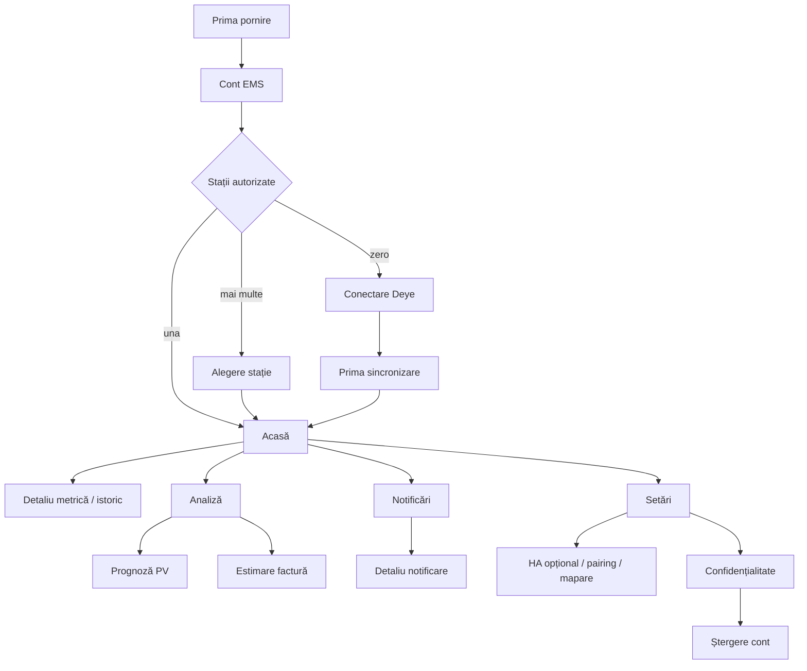

# EMS mobil v1 — specificație de produs

Livrabil pentru [#197](https://github.com/bbogdan59/EMS-management-platform/issues/197),
în cadrul [epicului #215](https://github.com/bbogdan59/EMS-management-platform/issues/215).
Baza analizei: `main` la `05bbc54`, 29 septembrie 2026.
Acesta este un proiect de produs și un prototip documentar, nu implementarea
aplicației. Valorile din wireframes sunt exemple fictive, marcate permanent.

## Livrabile și revizuire

- [Parcursuri și wireflow](JOURNEYS.md): intrări, pași, revenire și permisiuni.
- [Stări și contractul de afișare](STATES.md): fiecare ecran și integrare.
- [Măsurare și criterii de acceptare](MEASUREMENT.md): evenimente fără PII,
  obiective de produs și verificări pentru implementările ulterioare.
- [Wireframes interactive](wireframes.html): 320 × 640 și 430 × 860,
  teme luminoasă/întunecată, RO/EN, stări, una/mai multe stații, HA opțional.
- Cataloage [RO](strings.ro.json) și [EN](strings.en.json): aceleași chei
  stabile; EN este traducere de lucru pentru verificarea layoutului.

Din rădăcina repository-ului:

```sh
python3 -m http.server 8765 --bind 127.0.0.1 --directory docs/mobile
```

Deschide `http://127.0.0.1:8765/wireframes.html`. Prototipul citește doar
fișierele locale de traduceri; nu se conectează la EMS, Deye sau HA, nu
persistă date și nu trimite analytics. Butoanele simulează navigarea și
confirmările, fără autentificare, pairing sau ștergere reală. Nu introduce
date reale în prototip. Oprește serverul cu Ctrl+C.

Previzualizări statice pentru review direct în GitHub (restul ecranelor și
stărilor sunt disponibile în prototip):




## Repository-uri și responsabilități

[Harta canonică](../SOURCE_CODE_ARCHITECTURE.md) definește ownership-ul.
Fișierele HTML/CSS/JS de aici sunt exclusiv documentație executabilă,
neservită de aplicația FastAPI și nefolosită ca implementare mobilă.

| Repository | Livrabil ulterior |
|---|---|
| `EMS-management-platform` | Specificația de produs #197, contracte versionate/OpenAPI, auth/RBAC, integrări canonice, calcul/forecast/billing și workers. |
| `EMS-mobile-app` | React Native + Expo + TypeScript; navigație, UI, localizare, cache, EMS SecureStore/Keychain/Keystore, push și distribuție. |
| `EMS-home-assistant` | Integrare HA, config flow, pairing local, allowlist/mapare și sincronizare outbound. |
| `EMS-device-code` | Agent edge, RS485, siguranță și hardware; în afara scope-ului mobil v1. |

#215 rămâne umbrella; issue-urile #198–#216 sunt referințele de roadmap ale
platformei. Înaintea implementării cross-repository, autorul creează/linkuiește
issue-urile companion în repository-urile proprietare și ADR-ul contractului,
conform hărții. Ordine: contract/backend compatibil → client generat →
consumatori mobili/HA → verificări contract/staging → rollout. Nu se creează
un repository `EMS-contracts` și nu se schimbă un contract în acest PR.

## Obiectiv și public

Proprietarul unei instalații vede ce se întâmplă acum, ce a produs și ce
costuri se estimează, fără a interpreta un panou de administrare. Prima
experiență este pentru o singură stație. Un membru invitat poate consulta
aceleași informații, fără a primi automat dreptul de a schimba integrările.

Succesul inițial înseamnă afișarea primei măsurători reale, cu sursă și oră,
nu simpla salvare a unei conexiuni. Salvarea mapării HA nu dovedește că a
sosit o observație. Alertele sunt informații despre observațiile EMS, nu
diagnostice garantate sau constatări de conformitate legală.

## Scope și decizii v1

| Inclus | Comportament decis |
|---|---|
| Cont EMS | Creare cont, login, recuperare acces, sesiuni, logout; fără cont nou dacă există deja unul web. |
| Deye Cloud | Onboarding prin backend, alegerea stației, progres prima sincronizare, reconectare/deconectare. |
| Home Assistant opțional | Pairing outbound, selectare explicită a entităților permise, mapare și context informativ. „Mai târziu” este disponibil permanent în onboarding. |
| Acasă / Overview | Producție, consum, import/export, baterie dacă există, energie azi, calitate și sincronizare, comparații eligibile, rezumate prognoză/cost și alerte. |
| Analiză / Insights & Costs | Istoric zi/săptămână/lună, detaliu metrică, prognoză PV, prețuri contractuale și de piață distincte, estimare lunară. |
| Notificări | Inbox canonic, sumar ieri, incidente, detaliu, citire, preferințe și push opțional. |
| Setări | Integrări, profil/sesiuni, limbă/temă, notificări, privacy/consimțăminte, export și ștergere cont. |

Read-only se referă la instalație: v1 nu trimite comenzi fizice. Scrierile
pentru cont, integrări, consimțământ, notificări și ștergere sunt necesare,
autorizate și auditate pe server. Niciun buton „Aplică pe invertor”.

În afara v1: control invertor/baterie, RS485, OTA, EV și programare încărcare,
configurare tehnică avansată/tarife editabile, optimizare/manual override,
platform admin, portal instalatori, abonamente, client Lovelace sau control
arbitrar HA. Harta soarelui, pin-ul locației și editorul de umbrire rămân web
în v1; mobilul poate afișa efectul profilului existent în prognoză. Aceste
excluderi nu modifică funcțiile web.

## Arhitectura informației

Patru taburi persistente după autentificare. În RO: **Acasă**, **Analiză**,
**Notificări**, **Setări**. Titlurile complete rămân în ecrane; nu există
tab separat pentru stații sau HA.



- Zero stații: acțiune de conectare pentru administrator; pentru membrul
  invitat, „Nu ai acces la o stație. Cere acces administratorului”. Rămân
  disponibile profilul, ajutorul și ștergerea contului.
- O stație: nume simplu în antet, fără chevron și fără selector cu o opțiune.
- Mai multe: selector în antetele ecranelor de stație, grupat pe organizații.
  Se reține ultima alegere autorizată. Schimbarea anulează cererile vechi,
  separă cache-ul, resetează detaliile și revalidează accesul.
- Pierderea accesului în timp ce aplicația este deschisă golește datele
  stației și oferă o alegere validă; nu păstrează panoul anterior.
- Back revine la tabul și perioada de origine. Un deep link valid poate
  selecta o altă stație numai după verificarea accesului pe server.

## Ierarhia Overview

1. Numele stației, fusul ei orar, sursa și ultima observație; alertă de
   sincronizare separată de conectivitatea telefonului.
2. Puterea PV principală, apoi consum, rețea cu direcție explicită și SOC.
   Fluxul energetic este o reprezentare compactă, cu echivalent textual.
   Dacă direcția unei ramuri nu este cunoscută, acea ramură nu se animă.
3. Azi: producție/consum/import/export, acoperire per metrică și comparație
   cu aceeași porțiune scursă a zilei de ieri, când este comparabilă.
4. Autoconsum/autosuficiență numai dacă backendul furnizează valori și
   metoda; nu se deduc în client din puteri instantanee sau SOC.
5. Alertă importantă, prognoză mâine, estimare lunară și context HA activ.

Bateria absentă are starea „Fără baterie”, nu 0% SOC. Bateria prezentă cu
SOC necunoscut are „— · Fără date”. SOC 0% și schimb 0 kW sunt valori valide.
Un metric lipsă nu ascunde metricile disponibile. Overview face un request
compozit; seriile pentru grafice se cer separat, la nevoie.

## Home Assistant: limita produsului

Conectarea este opțională; lipsa HA nu produce un avertisment pe Acasă.
Cardul apare numai după activarea integrării și arată exclusiv entități
selectate. Niciun buton de pornire/oprire a boilerului sau HVAC.

| Categorie propusă #216 | Condiție de afișare |
|---|---|
| Putere/energie casă | Entitate și unitate validate; rămâne sursă HA separată. Nu suprascrie automat contorul Deye și nu intră de două ori în KPI. |
| Boiler/HVAC | Stare și/sau putere pentru consumatorul ales; interval declarat de flexibilitate, dacă există, etichetat „Declarat”. |
| Acasă/plecat/necunoscut | Un singur semnal agregat, opt-in separat, fără nume de persoane, coordonate sau istoric de mișcare. |
| Temperatură interioară agregată | Opțional, selectată și consimțită explicit; ascunsă dacă adaptorul nu declară suport. |

EVSE din lista de candidați #216 este amânat împreună cu EV pentru v1.
Nu se importă persoane, camere, încuietori, alarme, media, conversații sau
catalogul integral de entități. Alegerea începe local în HA; numai candidaturi
eligibile explicit autorizate ajung în picker-ul EMS. Nicio selecție implicită.

Pairing-ul și maparea nativă sunt cerințe viitoare #216, dependente de #189.
[PR #217](https://github.com/bbogdan59/EMS-management-platform/pull/217)
propune MQTT read-only și mapare manuală; nu oferă încă acest onboarding
mobil. Un broker configurat sau un fișier YAML descărcat nu echivalează cu
pairing finalizat. Nu cerem URL privat accesibil din cloud, port forwarding
sau token HA de lungă durată în aplicație.

## Matrice web → mobil și evidența din cod

„Reutilizare” înseamnă serviciu/domain pe server, nu copiere de Jinja sau
apelarea cu token mobil a rutelor web protejate prin cookie/CSRF.

| Funcție web și sursa analizată | Decizie mobil | Diferență / issue responsabil |
|---|---|---|
| [Overview Jinja](../../app/web/templates/dashboard/station.html), [summary/live/KPI](../../app/services/dashboard_service.py) | Reutilizare servicii, UI adaptată | Snapshot compozit cu proveniență per metrică #199/#202; `get_summary` singur nu este contractul mobil complet. |
| [One-station-first și JSON dashboard](../../app/web/routes/dashboard.py) | Reutilizare autorizare, adaptare navigație | Lista de stații cu capabilități #199; o singură stație intră direct pe Acasă. |
| [Auth web](../../app/web/routes/auth.py), [security](../../app/core/security.py) | Reutilizare identitate, sesiuni mobile noi | Web are login/invitații/reset și cookie; nu există încă signup public + refresh mobil #200. `/api/v1` pentru dispozitive nu autentifică persoane. |
| [Deye web](../../app/web/routes/deye_integration.py), [serviciu](../../app/services/deye_cloud_service.py) | Reutilizare conector, adaptare wizard | Fluxul actual cere app ID/secret și email/parolă pe server. Nu presupunem OAuth Deye. #201 livrează browser EMS + callback sigur și progres. |
| [Timeseries și agregare](../../app/services/chart_aggregation.py) | Reutilizare agregare, grafice native | Ruta web folosește ferestre mobile 24h/7d/30d; zi/săptămână/lună calendaristică cer limite explicite #199/#203, nu redenumirea ferestrelor. |
| [Modele forecast](../../app/models/forecast.py), [PV](../../app/services/pv_forecast_service.py) | Reutilizare forecast, adaptare explicații | #204 expune ediția, providerul, confidence și profilul; P10/P90 numai dacă există. |
| [Tarife](../../app/services/tariff_service.py), [setup RO](../ROMANIAN_TARIFF_SETUP.md) | Reutilizare formule, citire în mobil | Simularea web RO folosește cantități introduse și un set de tarife; nu este proiecție lunară din telemetrie. #205 livrează realizat/proiectat/istoric versionat. Editorul rămâne web. |
| [Notificări ieri/incidente](../STATION_NOTIFICATIONS.md), [rute](../../app/web/routes/diagnostics.py) | Reutilizare inbox/generare, UI adaptată | Web folosește offset, cookie/CSRF; #199 adaugă cursor, #206 push nativ per instalare. Web Push existent nu este APNs/FCM. |
| [Health](../HEALTH_DIAGNOSTICS.md) | Adaptare incident simplificat | Afișează observația/pragul/proveniența; fără „rețeaua este de vină” sau „încălcare legală” inferate. |
| HA #189 / PR #217 | Adaptare după backend | #216 pairing outbound și mapare; #199 transportul contextului; capabilitățile neimplementate rămân ascunse. |
| [RBAC](../RBAC_MATRIX.md), [deps](../../app/api/deps.py) | Reutilizare reguli server | Viewer citește; organization_admin gestionează conexiunile. Capabilitățile controlează UI, serverul verifică fiecare operație. |
| Privacy/export/ștergere cont | Funcție nouă #207 | CSV energetic web nu este exportul complet al datelor personale; nu există lifecycle complet de ștergere mobilă. |
| Pin/hartă soare, editor profil, tarife/config avansată | Web-only v1 | Link browser autentificat separat dacă utilizatorul are drepturi; fără token în URL. |
| Control, planuri, OTA, RS485, EV, backoffice | Web-only / exclus mobil v1 | Fără endpointuri de comandă sau controale ascunse în meniul mobil. |

## Contracte de produs pentru implementare

API-ul mobil propus este responsabilitatea #199; acest PR nu adaugă rute.
`GET /api/v1/mobile/overview` din acel issue este o propunere, nu endpoint
disponibil. Contractele finale trebuie publicate în OpenAPI înainte de client.

- Fiecare metrică: valoare nullable, unitate, sursă, calitate, observed/measured
  și received timestamps, acoperire pe interval când este agregată. Expirarea
  prospețimii vine din politica serverului pentru sursa respectivă; clientul
  actualizează eticheta de vârstă inclusiv când nu sosesc pachete.
- Putere și SOC sunt medii pe bucket; energia este aditivă. Golurile rămân
  goluri, fără interpolare ca măsurare. Timestampuri UTC aware, afișare în
  fusul stației; zi/săptămână/lună în calendarul local, DST și an bisect incluse.
- Energie/bani în Decimal pe server; valoarea exactă serializată conform
  contractului mobil, fără calcule financiare în JavaScript/React Native.
  Clientul doar localizează unitățile, data și numerele.
- API-ul decide comparația și eligibilitatea acesteia. Pentru o valoare de
  referință zero, nu se afișează un procent infinit. Simularea/estimarea
  oricărui segment, inclusiv carry-in, rămâne vizibilă în rezultat.
- Forecastul păstrează `issued_at` distinct de ultima descărcare. Un nou
  refresh nu face o prognoză veche proaspătă; lipsa shadingului este vizibilă.
- Factura separă costul acumulat estimat de proiecția restului lunii și de
  totalul lunii precedente. Comparația „până azi” folosește aceeași durată
  eligibilă; comparația proiecție vs luna precedentă este etichetată separat.
  Tarifele se aplică în intervalele lor istorice, nu retroactiv.
- Tarife fixe/dinamice, taxe, TVA, export/credit, surplus și ipoteze se
  explică separat. Prețul OPCOM nu înlocuiește contractul utilizatorului.
  Orice componentă necunoscută poate face totalul indisponibil; lipsa unui
  registru de reportare nu este compensată printr-un sold inventat.
- Cache minimizat per utilizator/organizație/stație, etichetat cu ora lui,
  șters la logout/revocare/ștergere; #208 stabilește TTL și bugetul exact.
  V1 nu salvează occupancy în cache persistent. Nicio scriere sensibilă în
  coadă offline. Reconectarea recitește starea serverului înainte de retry.

## Design și accesibilitate

Direcția vizuală continuă dashboardul web: verde salvie/oliv, suprafețe
calme, accent solar galben, spațiu pentru valori mari. Calitatea folosește
text și simboluri, nu numai culoare. Roșul indică acțiuni distructive/erori,
nu orice lipsă de date.

Proiectare la 320 și 430 puncte logice; carduri într-o coloană când textul
nu încape, safe areas, scroll vertical fără gesturi de zoom care blochează
pagina. Țintă produs: controale minimum 48 × 48, text scalabil până la 200%,
contrast text normal minimum 4.5:1, focus vizibil, VoiceOver/TalkBack,
reduced motion. Graficele au sumar și alternativă tabel, nu doar culori sau
tooltip la hover. Aceste ținte cer verificare pe device în #210; prototipul
în browser nu dovedește accesibilitatea aplicației native.

RO este limba v1. Cheile din catalog sunt semantice, nu propoziții ca ID.
Fără concatenare de fragmente traduse; interpolări numite și pluralizare
în implementarea #198. Date/numere/lei sunt formatate prin locale; fusul
afișării rămâne cel al stației, chiar când telefonul călătorește. EN servește
testării lungimii textului; lansarea EN se decide separat.

## Predare și trasabilitate #197

| Criteriu issue | Livrabil |
|---|---|
| Parcursuri first launch/auth/Deye/HA/Overview/metrică/factură/notificare/ștergere | [JOURNEYS](JOURNEYS.md), S01–S17 în prototip |
| Cele patru taburi și one-station-first | Arhitectura informației + controlul „Stații” în prototip |
| HA opțional, allowlist, proveniență | Limita HA + J04 + controlul „Context HA” |
| Empty/loading/error/stale/offline | [STATES](STATES.md) + selectorul de stare |
| RO și catalog EN-ready | Cele două cataloage cu chei identice |
| Reuse/adapt/web-only | Matricea cu surse din cod de mai sus |
| Telefoane mici/mari și dark mode | Wireframes responsive, controale dimensiune/temă |
| Analytics și succes fără PII | [MEASUREMENT](MEASUREMENT.md) |

#197 închide specificația, nu promite funcționalitatea mobilă în producție.
Implementarea continuă cu #198 (repo/design system), #199 (API), #200 (auth),
#201/#216 (onboarding), #202–#208 (ecrane/privacy/cache), #209–#214
(observabilitate/QA/distribuție). Pairing #189/#216, bill projection #205,
privacy #207 și transportul push #206 au criterii proprii de livrare.
